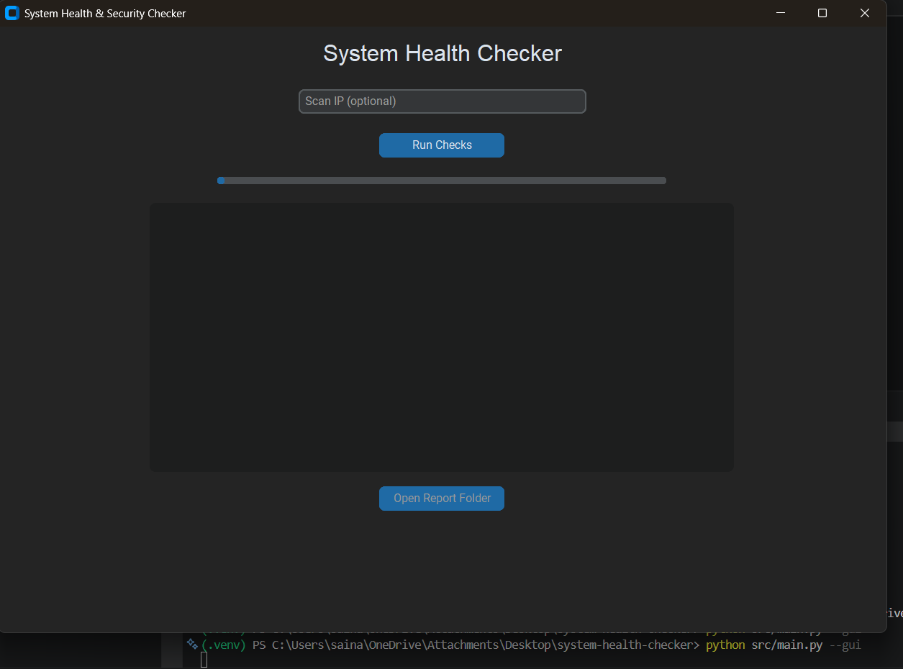
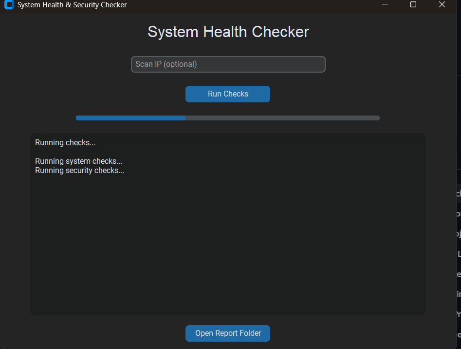
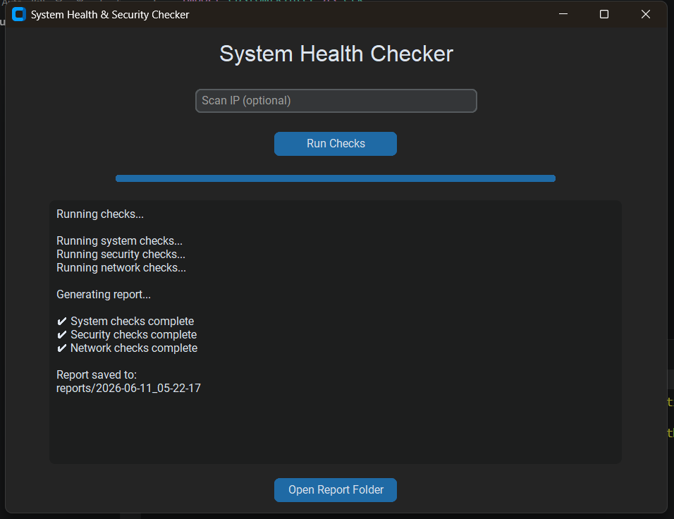
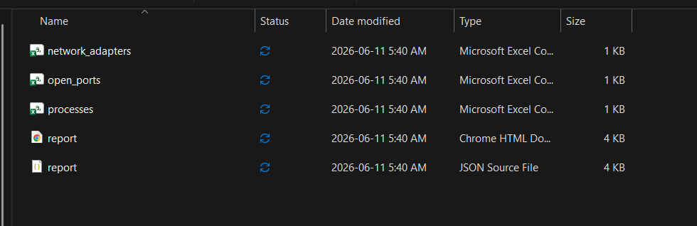
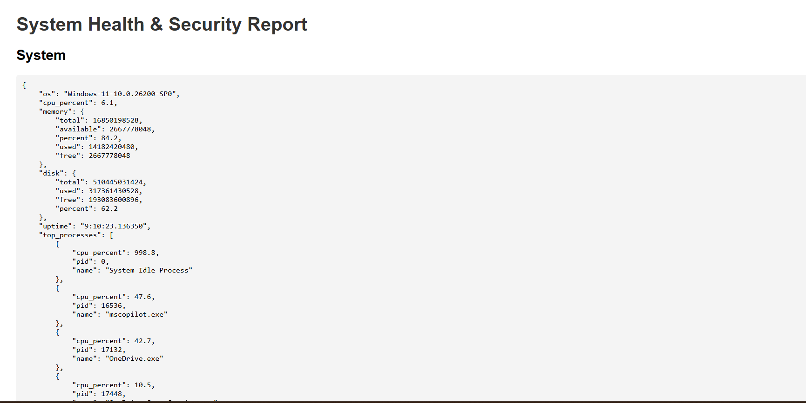

🖥️ System Health & Security Checker
A simple, clean desktop tool that checks your system health, basic security settings, and optional network info
then generates a full report (JSON, CSV, HTML) in a timestamped folder.

This project was built for learning, experimenting, and making system checks easier for everyday users.

🚀 Features
System health checks (CPU, RAM, disk, OS info)

Security checks (firewall, antivirus, updates)

Optional network scan (if you enter an IP)

Clean CustomTkinter GUI

Progress bar + live status updates

Auto‑generated reports (JSON, CSV, HTML)

“Open Report Folder” button for quick access

📦 Requirements
Python 3.10+

Install dependencies:

bash
pip install -r requirements.txt
▶️ How to Run the App (IMPORTANT)
There are two ways to run this project : but only one is recommended.

✅ Recommended: Run the Python version
This version shows the full GUI properly (progress bar + buttons).

From the project folder:

bash
python src/main.py --gui
Use this version for normal use, development, and testing.

⚠️ Optional: Running the EXE
You can run the EXE inside the dist/ folder:

Code
system-health-checker.exe
It works, but:

The scan runs extremely fast

The progress bar animation may not show

GUI updates may appear instant

This is normal — the EXE runs much faster than the Python script.

If you want the full GUI experience, use the Python version.

📸 Screenshots
### Main GUI

### Running Scan

### Scan Complete

### Report Folder

### HTML Report (Optional)

📁 Report Output
Each scan creates a folder like:

reports/2026-06-11_05-22-17/
Inside you’ll find:

report.json

report.csv

report.html

👩🏽‍💻 Project Structure
system-health-checker/
│
├── src/
│   ├── main.py
│   ├── gui.py
│   ├── system_checks.py
│   ├── security_checks.py
│   ├── network_checks.py
│   └── report_generator.py
│
├── images/        
├── dist/          
├── reports/       
├── README.md
└── requirements.txt

Built by Sainabou Camara  
A simple project turned into a clean, functional desktop tool.
